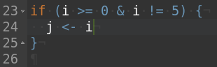
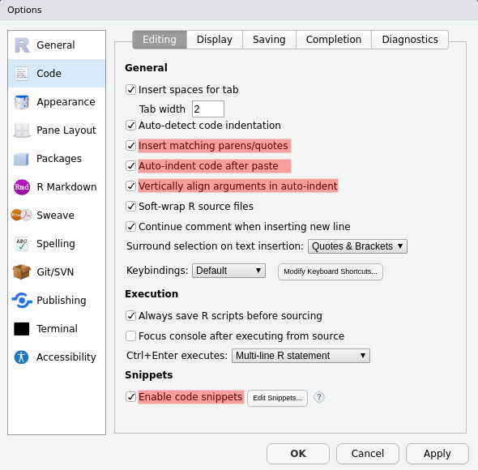
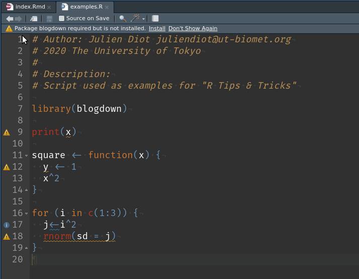
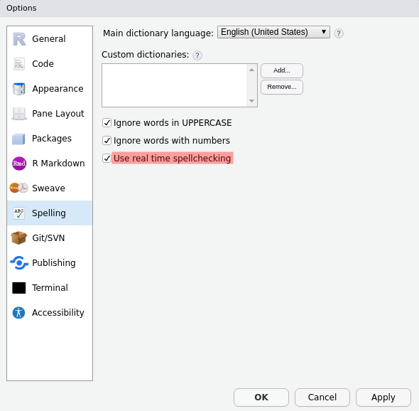
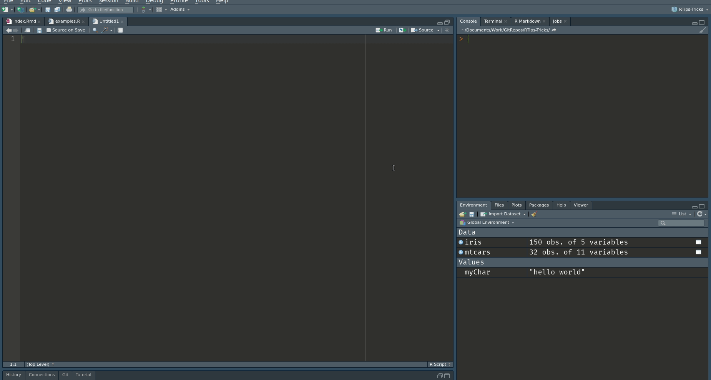
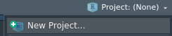

```{r setup, include=FALSE}
knitStartTime <- Sys.time()
knitr::opts_chunk$set(echo = TRUE,
                      eval = TRUE,
                      include = TRUE,
                      warning = TRUE,
                      message = TRUE,
                      cache = FALSE, # save chunks output
                      results = "hold", # display chunk output in one block
                      
                      # df_print paged options
                      rows.print = 10,
                      max.print = Inf,
                      
                      
                      # format
                      tidy = FALSE, # format code with 'tidy_source()'
                      tidy.opts = list(width.cutoff = 80),
                      strip.white = TRUE, #remove the white lines in the beginning or end of a source chunk
                      
                      fig.align = "center",
                      fig.width = 9,
                      fig.height = 5)

knitr::opts_knit$set(progress = TRUE,
                     verbose = FALSE,
                     width = 80)

# compile css
sass::sass(input = sass::sass_file("src/myStyle.scss"),
           output = "src/myStyle.css")
```

```{css echo=FALSE, eval = TRUE}
/* add some CSS styling here */
```

**Disclaimer**

The R Tips and Tricks presented here **are just what I use**, I don't guarantee that this is the best way to do it. Moreover, new features are developed every days some stuffs presented here might be outdated in the future. If you have any comments or suggestions feel free to contact me: juliendiot@ut-biomet.org or post an issue on [GitHub](https://github.com/juliendiot42/RTips-Tricks/issues).


**Packages / R-options:**
```{r pkgs_options, results='hide'}
suppressPackageStartupMessages({
 library(fs)
})

#  R options
options(max.print = 20)

# variables
R <- fontawesome::fa("r-project", height = "20px", fill = "steelblue")
```


# Ideas

<!-- - Rstudio **settings**: -->
<!--   - Code: Editing, display, completion, diagnostic -->
<!--   - Appearance: black theme, font (fira code) -->
<!--   - **Pane layout** -->
<!--   - spelling -->
  
- Rstudio **features**:
  - click to see variables
  - keyboard shortcut
  - R-project (project options)
    - `renv` package
  - addins
  - Code Outline (navigate in code)
  

- useful R functions: 
  - debugging with `browser()`
  - get code form object with `dput()`
  - use `saveRDS` instead of save (for one variable)
  
  
- rmarkdown:
  - rmd templates
  - Appendix `sessionInfo()`

- snippets
- Cheat sheets
- .Rprofile

- technical monitoring
  - CRAN alerts
  - R bloggers

- Performances
  - code profiling
  - microbenchmark

- Rstudio 1.3
  - https://rstudio.com/products/rstudio/download/preview/

- Resources
  - R bloggers
  - Hadley's books
  - https://holtzy.github.io/Pimp-my-rmd/

# Setup R-Studio

My favorite `r R` IDE is [R-Studio Desktop](https://rstudio.com/products/rstudio/download/#download). It is free and open-source and provides a lot of powerful features.

This section presents interesting R-Studio settings and my current setup.

To setup R-Studio go to: `Tools -> Global Options...`.

A documentation for these settings is available [here](https://support.rstudio.com/hc/en-us/articles/200549016-Customizing-RStudio). It might not be up to date but most of the settings are presented.

<div class="note">
Some useful R-Studio settings are not activated by default, I think it's worth taking some time to check these settings.
</div>


## Pane layout and appearance

`Tools -> Global Options... -> Pane layout`

In order to have **more space for the editor**, we can **move the console on the top right corner** and move the "Environment pane" to the bottom right.

Indeed, the panes on the bottom left do not need to be displayed constantly.


As you can see, I prefer **dark theme** because it's more pleasant for my eyes. My favorite one is "Idle Fingers". However, several other themes are available, some a light other are black.

I also use the font [**"Fira code"**](https://github.com/tonsky/FiraCode), this font provide programming ligatures:

<div class = "row">
<div class = "col-md-6">


</div>
  
<div class = "col-md-6">


</div>
</div>


## General settings {#generalSettings}


It is important to **not** restore or save your workspace at startup or end of the R session. By this way, you will always start R-Studio in a fresh and clean environment, and  because you have saved your script you can regenerate the environment by running it. This is much better for the reproducibility of your work.


## Code settings {.tabset .tabset-fade .tabset-pills}

`Tools -> Global Options... -> Code`

I present here my personal settings. The highlighted lines are those I find interesting.

### Editing





- **Insert matching parens/quotes**: When typing a paren, quote, or brace automatically insert a matching one and position the cursor between them.
- **Auto-indent code after paste**: Automatically execute a Reindent on blocks of R code pasted into the editor.
- **Vertically align arguments in auto-indent**: Preserve the current indentation level for function arguments split across multiple lines.
- **Enable code snippets**: see the corresponding [section](#snippets).


### Display

<center>

</center>

- **Highlight selected word**: Add a background highlight effect to all instances of the currently selected word within the document. (Useful to find some variables in the code)
- **Show line numbers**: Show or hide line numbers within the left margin. (Useful for debugging)
- **Show margin**: Display a margin guide on the right-hand side of the source editor at the specified column. (The "good practices" require to have line smaller than 80 characters)
- **Show whitespace characters**: Display glyphs indicating where whitespace characters (tab, newline, etc.) are located in source documents. (Useful to detect "double spaces" and tabulation)
- **Highlight R function calls**: Highlight R functions. (Better distinction between functions and other R objects)

### Saving

<center>

</center>

- **Ensure that source files end with a new line**: It's a good practice to end coding file with a new line.
- **Strip trailing horizontal whitespaces when saving**: Remove whitespaces from blank line:


- **Auto-save**: New feature of **R-Studio 1.3**

### Completion

<center>

</center>

Completion help to write functions name and their parameters just by taping the first letters and the `tab` key:


### Diagnostics

<center>

</center>

- **Show diagnostics for R**: Check to display alert messages in the margin of the editor when R code appears incorrect.




## Spellchecking




# Working with R-Studio

- Rstudio **features**:
  - click to see variables
  - keyboard shortcut
  - R-project (project options)
    - `renv` package
  - addins
  - Code Outline (navigate in code)


## Panes {.tabset .tabset-fade .tabset-pills}

### Environment


- The Environment pane presents the variables defined in your environments. By default, it shows the global environment but you can select others (like those of the loaded packages).

- The  button clear the workspace.

- An easy and graphical way to import data of different types (text, excel, SAS ...) is to use the  button. The corresponding R code will be written in the console, you can then copy/paste it in your scripts.

- You can visualize the variables defined in your environments by clicking on them. This is a shortcut for a call to the R function `View()`.




### File browser


By default, it is open at your current working directory. You can navigate through your file and set up a new working directory with the button .

It's quite convenient to manage the files directly from R-Studio. If you are working in a [projects](#Rproj), you can quickly access to your root folder with the  button. 


### Packages


In the package pane, you can **install new packages**. It's particularly convenient when you don't know the exact package name.


With the update button you can also check if some of your packages are not up to date. With the  button, you can access to **the news file** of these packages to see what is new. (See also section [CRANalert](#cranalert) for a notifier tools about updated packages).


### Jobs


Click on the  button or source a file as a local job to run an R script in an background R session.


By this way you can continue to work on R-Studio with an available console while a script is running.


<div class="note">
You can find more information on this [R-Studio blog post](https://blog.rstudio.com/2019/03/14/rstudio-1-2-jobs/).
</div>


<!-- ### Build -->

<!--  -->

<!-- When you develop a R package, you can manage your test / checks / build in the pane.-->

### Git


If you work with Git in your R-Project, you can run the main git commands in this pane: 

- Stage / commit
- Pull / Push
- View diff and history
- Create / checkout branches

### Tutorial

<div class="note">
It7s a new feature included in R-Studio 1.3
</div>

Some R packages provides tutorials thanks to the [`learnr`](https://rstudio.github.io/learnr/) package. You can try them in this pane. 


## R-Project {#Rproj}

When you work, ~~I hope~~ you keep all your files associated with a project in one specific directory in your computer. R-Studio provide a built-in support for this via "projects".

You can find some information about R-Project in this [R-Studio support article](https://support.rstudio.com/hc/en-us/articles/200526207-Using-Projects)
 or at this [*R for Data Science* section](https://r4ds.had.co.nz/workflow-projects.html#rstudio-projects).

### Advantages 

The main advantages to work with R-Projects are:

- When a R-Project is open, the current working directory is automatically set to the project directory. A R-Project can then be **shared across multiple users** on different computers without thinking about setting the working directory.

- When a R-Project is open, you get back to where you left off: The **previously opened files are restored** into the editor tabs such as the command history (if it had been saved). Even the files that had *never* been saved (named `Untitled1` in the editor) are restored.

- You can use Git from R-Studio.

<div class="note">
Of course the global environment is not restored if R-Studio is setup correctly as explained in this [section](#generalSettings).
</div>

### Create R-Project 

You can create a new R-Project either by clicking on `File -> New Project...` or on the  button.

You can then choose to create it in an existing directory, or to create a new one. In this case, R-Studio provides different templates: "R package", "Shiny Web Application", "Plumber API" ... After creation, the directory will already contain some files and folder.


There is no template for data analysis projects, but a simple structure can be:

```{r echo=FALSE}
dir_tree("projectExample/")
```


### How it works 

R project is a directory containing a `.Rproj` file which can be open by R-Studio. When you open a `.Rproj` file, the following happens:

- A new R session (process) is started
- The `.Rprofile` file in the project's main directory (if any) is sourced by R
- The `.RData` file in the project's main directory is loaded (if project options indicate that it should be loaded). 
- The `.Rhistory` file in the project's main directory is loaded into the R-Studio history pane (and used for Console Up/Down arrow command history).
- The current working directory is set to the project directory.
- Previously edited source documents are restored into editor tabs
- Other R-Studio settings (e.g. active tabs, splitter positions, etc.) are restored to where they were the last time the project was closed.

The `.Rproj` file is a text file (you can try to open it with a text editor) containing the project settings. These settings can be modified in `Tools -> Project Options...`. It is important to know that **these settings have priority** over the standard R-Studio settings.


<h2></h2>
<div class="note">

- If your R project is included in a Google Drive folder, you can encounter some troubles when saving your files.

- Even if the `.Rproj.user` folder is not so big, it can contain a lot of small files. It can then take a long time be synchronized on clouds services.

</div>


# Snippets {#snippets}

# External ressourses

## CRANalert {#cranalert}


<h1>Appendix</h1>

Source code of this document is available on [GitHub](https://github.com/juliendiot42/RTips-Tricks).

```{r sessionInfo}
options(max.print = 10000)
cat("Document generated in:\n")
print(Sys.time() - knitStartTime)
if (Sys.info()["sysname"] == "Linux") {
  cat("\nCPU: ")
  cat(unique(system("awk -F': ' '/model name/{print $2}' /proc/cpuinfo", intern = T)))
  cat("\nMemory total size: ")
  cat(as.numeric(system("awk '/MemTotal/ {print $2}' /proc/meminfo", intern = T))*10^(-6), "GB")
}
cat("\n\n\nSession information:\n")
print(sessionInfo(), locale = FALSE)
```
