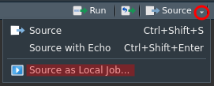

```{r setup, include=FALSE}
knitStartTime <- Sys.time()
knitr::opts_chunk$set(echo = TRUE,
                      eval = TRUE,
                      include = TRUE,
                      warning = TRUE,
                      message = TRUE,
                      cache = FALSE, # save chunks output
                      results = "hold", # display chunk output in one block

                      # df_print paged options
                      rows.print = 10,
                      max.print = Inf,


                      # format
                      tidy = FALSE, # format code with 'tidy_source()'
                      tidy.opts = list(width.cutoff = 80),
                      strip.white = TRUE, #remove the white lines in the beginning or end of a source chunk

                      fig.align = "center",
                      fig.width = 9,
                      fig.height = 5)

knitr::opts_knit$set(progress = TRUE,
                     verbose = FALSE,
                     width = 80)

# compile css
sass::sass(input = sass::sass_file("src/myStyle.scss"),
           output = "src/myStyle.css")
```

```{css echo=FALSE, eval = TRUE}
/* add some CSS styling here */
```

```{r pkgs_options, results='hide', echo=FALSE}
suppressPackageStartupMessages({
 library(fs)
 library(emo) # devtools::install_github("hadley/emo")
})

#  R options
options(max.print = 200)

# variables
R <- fontawesome::fa("r-project", height = "20px", fill = "steelblue")

set.seed(1993)
```

**Disclaimer**

The R Tips and Tricks presented here **are just what I use**, and I don't guarantee that this is the best way to do it. Moreover, new features are developed every days some stuff presented here might be outdated in the future. If you have any comments or suggestions, feel free to contact me: [juliendiot\@ut-biomet.org](mailto:juliendiot@ut-biomet.org){.email} or post an issue on [GitHub](https://github.com/juliendiot42/RTips-Tricks/issues).

# R-Studio configuration

My favourite `r R` IDE is [R-Studio Desktop](https://rstudio.com/products/rstudio/download/#download). It is free and open-source and provides a lot of powerful features.

This section presents interesting R-Studio settings and my current setup.

To setup R-Studio go to: `Tools -> Global Options...`.

Documentation for these settings is available [here](https://support.rstudio.com/hc/en-us/articles/200549016-Customizing-RStudio). It might not be up to date, but most of the settings are presented.

::: {.note}
Some useful R-Studio settings are not activated by default, and I think it's worth taking some time to check these settings.
:::

## Pane layout and appearance

`Tools -> Global Options... -> Pane layout`

To have **more space for the editor**, we can **move the console on the top right corner** and move the "Environment pane" to the bottom right.

Indeed, the panes on the bottom left do not need to be continuously displayed.


As you can see, I prefer **dark theme** because it's more pleasant for my eyes. "Idle Fingers" is used on the image above. However, several other themes are available, some a light other are black.

It is also possible to create **your own custom themes** as explain in this [R-Studio blog's article](https://blog.rstudio.com/2018/10/29/rstudio-ide-custom-theme-support/)

I also use the font [**"Fira code"**](https://github.com/tonsky/FiraCode), this font provide programming ligatures:

::: {.row}
::: {.col-md-6}

:::

::: {.col-md-6}

:::
:::

## General settings {#generalSettings}


It is essential to **not** restore or save your workspace at startup or end of the R session. By this way, you will always start R-Studio in a fresh and clean environment. Because you have saved your script, you can regenerate the situation by running it. This is much better for the reproducibility of your work.

## Code settings {.tabset .tabset-fade .tabset-pills}

`Tools -> Global Options... -> Code`

I present here R-Studio code settings. The highlighted lines are those I find interesting.

### Editing


-   **Insert matching parens/quotes**: When typing a paren, quote, or brace automatically insert a matching one and position the cursor between them.
-   **Auto-indent code after paste**: Automatically execute a Reindent on blocks of R code pasted into the editor.
-   **Vertically align arguments in auto-indent**: Preserve the current indentation level for function arguments split across multiple lines.
-   **Enable code snippets**: see the corresponding [section](#snippets).

### Display

<center>


</center>

-   **Highlight selected word**: Add a background highlight effect to all instances of the currently selected word within the document. (Useful to find some variables in the code)
-   **Show line numbers**: Show or hide line numbers within the left margin. (Useful for debugging)
-   **Show margin**: Display a margin guide on the right-hand side of the source editor at the specified column. (The "good practices" require to have line smaller than 80 characters)
-   **Show whitespace characters**: Display glyphs indicating where whitespace characters (tab, newline, etc.) are located in source documents. (Useful to detect "double spaces" and tabulation)
-   **Highlight R function calls**: Highlight R functions. (Better distinction between functions and other R objects)
-   **Rainbow Parentheses**: Being able to color your parentheses (and brackets and braces) based on the level of nesting. See [here](https://blog.rstudio.com/2020/11/04/rstudio-1-4-preview-rainbow-parentheses/)

### Saving

<center>


</center>

-   **Ensure that source files end with a new line**: I It's a good practice to end the coding files with a new line.
-   **Strip trailing horizontal whitespaces when saving**: Remove whitespaces from blank line:


-   **Auto-save**: New feature of **R-Studio 1.3**

### Completion

<center>


</center>

Completion help to write functions name and their parameters just by taping the first letters and the `tab` key:


### Diagnostics

<center>


</center>

-   **Show diagnostics for R**: Check to display alert messages in the margin of the editor when R code appears incorrect.


## Spellchecking


## Export your configuration

From R-Studio 1.3, the configuration is saved at `~/.config/rstudio` for Linux/MacOS users and at `AppData/Roaming/RStudio` on Windows. It is then easy to save and retrieve your configuration. This folder contains:

-   The R-Studio settings: `rstudio-pref.json`
-   The [snippets](#snippets)
-   The personal dictionary
-   The personal keyboard shortcuts definitions

# `.Rprofile` file

The `.Rprofile` file can be used to customize the environment at the startup of R. It should be placed in the HOME directory, or inside a folder of an R-project. (In this case, the one inside the project take precedence over the other).

When R starts, it automatically sources the `.Rprofile` file. So it can be used to set up some R options like: `options(max.print = 200)` to reduce the number of printed lines or `options("scipen" = 999)` to disabled the scientific notation.

There are also two particular functions: `.First( )` which will be run at the start of the R session and `.Last( )` at the end of the session.

You can try to copy these lines in your `.Rprofile` file:

```{r eval=FALSE}
.First <- function() {
  cat("Welcome", Sys.info()["user"], "!\n")
}
```

::: {.NOTE}
You should not modify options that can have an effect on the R behavior ! For example setting `options(stringsAsFactors = TRUE/FALSE)` in your `.Rprofile` file is a bad idea. Indeed, your codes might not run well on another computer.
:::

# Working with R-Studio

## Panes {.tabset .tabset-fade .tabset-pills}

### Environment


-   Environment pane presents the variables defined in your environments. By default, it shows the global environment, but you can select others (like those of the loaded packages).

-   The  button clears the workspace.

-   An easy and graphical way to import data of different types (text, excel, SAS ...) is to use the  button. The corresponding R code will be written in the console, and you can then copy/paste it in your scripts.

-   You can visualize the variables defined in your environments by clicking on them. This is a shortcut for a call to the R function `View()`.


### File browser


By default, it is open at your current working directory. You can navigate through your file and set up a new working directory with the button .

It's quite convenient to manage the files directly from R-Studio. If you are working in a [project](#Rproj), you can quickly access to your root folder with the  button.

### Packages


In the package pane, you can **install new packages**. It's particularly convenient when you don't know the exact package name.


With the update button you can also check if some of your packages are not up to date. With the  button, you can access **the "news file"** of these packages to see what is new. (See also section [CRANalert](#cranalert) for a notifier tool about updated packages).


### Jobs


Click on the  button or source a file as a local job to run an R script in a background R session.



By this way, you can continue to work on R-Studio with an available console while a script is running.


::: {.note}
You can find more information on this [R-Studio blog post](https://blog.rstudio.com/2019/03/14/rstudio-1-2-jobs/).
:::

<!-- ### Build -->

<!--  -->

<!-- When you develop a R package, you can manage your test / checks / build in the pane.-->

### Git

R-Studio have an integrated GIT client.


If you work with Git in your R-Project, you can run the main git commands in this pane:

-   Stage / commit
-   Pull / Push
-   Create / checkout branches

You can also open a dedicated window to see your history and the "file differences": `Ctrl` + `Alt` + `D`.

### Tutorial

Some R packages provide tutorials thanks to the [`learnr`](https://rstudio.github.io/learnr/) package. You can try them in this pane.


## Addins

Some R packages include some R-Studio "addins".

You can launch an addin using the  button.

These addins provides new functionality to R studio like: [Color picker](https://github.com/daattali/colourpicker), [create data.frame from clipboard](https://github.com/MilesMcBain/datapasta)...


## Commands palette

From version 1.4, R-Studio have a commands palette you can trigger with `Ctrl + Shift + P`.
This commands palette can let you search and execute R-Studio's commands.

You can try typing to get an idea of what is possible:

- `create`
- `rename`
- `find`
- `python`


::: {.note}
More info [on R-Studio's website](https://www.rstudio.com/blog/rstudio-v1-4-preview-command-palette/)
:::


## R-Project {#Rproj}

When you work, ~~I hope~~ you keep all your files associated with a project in one specific directory in your computer. R-Studio provides a built-in support for this via "projects".

You can find some information about R-Project in this [R-Studio support article](https://support.rstudio.com/hc/en-us/articles/200526207-Using-Projects) or at this [*R for Data Science* section](https://r4ds.had.co.nz/workflow-projects.html#rstudio-projects).

### Advantages

The main advantages to work with R-Projects are:

-   When an R-Project is open, the current working directory is automatically set to the project directory. An R-Project can then be **shared across multiple users** on different computers without thinking about setting the working directory.

-   When an R-Project is open, you get back to where you left off: The **previously opened files are restored** into the editor tabs such as the command history (if it had been saved). Even the files that had *never* been saved (named `Untitled1` in the editor) are restored.

-   You can use Git from R-Studio.

::: {.note}
Of course, the global environment is not restored if R-Studio is set up correctly, as explained in this [section](#generalSettings).
:::

### Create R-Project {#createRproj}

You can create a new R-Project either by clicking on `File -> New Project...` or on the  button.

You can then choose to create it in an existing directory, or to create a new one. In this case, R-Studio provides different templates: "R package", "Shiny Web Application", "Plumber API" ... After creation, the directory will already contain some files and folder.


There is no template for data analysis projects, but a simple structure can be:

```{r echo=FALSE}
dir_tree("projectExample/")
```

### How it works

R project is a directory containing a `.Rproj` file which can be open by R-Studio. When you open a `.Rproj` file, the following happens:

-   A new R session (process) is started
-   The `.Rprofile` file in the project's main directory (if any) is sourced by R
-   The `.RData` file in the project's main directory is loaded (if project options indicate that it should be loaded).
-   The `.Rhistory` file in the project's main directory is loaded into the R-Studio history pane (and used for Console Up/Down arrow command history).
-   The current working directory is set to the project directory.
-   Previously edited source documents are restored into editor tabs
-   Other R-Studio settings (e.g. active tabs, splitter positions, etc.) are restored to where they were the last time the project was closed.

The `.Rproj` file is a text file (you can try to open it with a text editor) containing the project settings. These settings can be modified in `Tools -> Project Options...`. It is essential to know that **these settings have priority** over the standard R-Studio settings.

<h2>

</h2>

::: {.note}
-   If your R project is included in a Google Drive folder, you can encounter some troubles when saving your files.

-   Even if the `.Rproj.user` folder is not so big, it can contain a lot of small files. It can then take a long time to be synchronized on clouds services.
:::

## Keyboard shortcuts and useful command

R-Studio provide a lot of **handy commands** accessible from the menu bar (`File`, `Edit`, `Code`, `Session` ... ).

These commands are linked to keyboard shortcuts. Even if it is not easy to learn, it will significantly improve your comfort (and productivity).

The default shortcuts can be modified through: `Tools -> Modify keyboard shortcuts...`

The list below is just a non-exhaustive list of my favourite shortcuts / functionality.

::: {.note}
-   Remember, if you are doing an annoying and repetitive task, there is probably a shortcut for that!
:::

### My top 5

First a quick summary of my most useful ones:

| Shortcut | Effect |
|---|---|
| `Ctrl` + `Shift` + `F10` | Restart R the session. |
| `Ctrl` + `Shift` + `C` | Toggle current/selected line(s) |
| `F1` | Show function help |
| `Ctrl` + `Enter` | Run current/selected lines(s) |
| `Ctrl` + `F7` | Add a new source column (you can remove it by closing all its tabs (`Ctrl` + `W`)) |

### Basic

Some of these shortcuts are similar to those of other software.

| Shortcut | Effect |
|--|--|
|`Ctrl` + `Z` | Undo |
|**`Ctrl` + `Shift` + `Z`** | Redo (this is not the usual convention!) |
|`Ctrl` + `O` | **O**pen file |
|`Ctrl` + `A` | Select **a**ll |
|`Ctrl` + `S` | **S**ave file |
|`Ctrl` + `F` | **F**ind in the current file |
|**`Ctrl` + `Shit` + `F`**| **F**ind in files (to search across multiple files) |
|**`Ctrl` + `w`** | Close tab |
|**`Ctrl` + `Tab`** | Go to next tab |
|`Ctrl` + `Q` | Quit R-Studio |
|`Tab` | Indent / Autocompletion |
|`Shift` + `Tab` | Outdent |
|**`Ctrl` + `Shift` + `F10`** | Restart R session. **You should do it quite often!** |
|`Ctrl` + `Shift` + `H` | ~~Choose working directory~~ Not needed because you are working in an R project. 😉 |
|**`Ctrl` + `F7`** | Add a new source column (you can remove it by closing all its tabs (`Ctrl` + `W`)) |


### Help

| Shortcut | Effect |
|--|--|
|**`Alt` + `Shift` + `K`** | Show **k**eyboard shortcuts |
|`F1` | Show function help |
|**`Ctrl` + `Click`** | (on a function) Go to function definition. |

### Run code

| Shortcut | Effect |
|--|--|
|`Ctrl` + `Enter` | Run selected lines |
|`Ctrl` + `Alt` + `B`/`E` | Run code from **B**egining to line or from line to **E**nd |
|`Ctrl` + `Alt` + `Shift` + `P` | Profile selected lines (see: [profiling section](#profiling)) |

### Editor

| Shortcut | Effect |
|--|--|
|**`Alt` + `-`** | insert `<-` |
|`Ctrl` + `Shift` + `M` | insert a pipe `%>%` |
|`Ctrl` + `Shift` + `C` | (un)**C**omment code |
|`Ctrl` + `Shift` + `/` | Reflow comment |
|`Ctrl` + `I` | Auto **i**ndentation |
|`Ctrl` + `Shift` + `A` | Auto reformat code (with format convention) |
|**`Ctrl` + `P`**| Jump to Matching Brace/Paren. Very useful to **debug "Brace related errors"** |
|`Ctrl` + `Alt` + `Up`/`Down` | Add cursor above or below |
|`Ctrl` + `Alt` + `Click` | add a new cursor (Useful on Windows when you copy/paste file path and you want to double the `/`) |
|**`Ctrl` + `Alt` + `Shift` + `M`**| Rename in scope. It is much more intelligent than a simple "find and replace". On the example below, neither the variable `a` outside the function nor the variable `alex` is affected. |

### R markdown

| Shortcut | Effect |
|--|--|
|**`Ctrl` + `Shit` + `K`**| **K**nit document |
|`Shit` + `Tab` | Autocompletion / snippets |
|**`Ctrl` + `Alt` + `I`** | **I**nsert a new chunk |
|**`Ctrl` + `Shift` + `Enter`**| Run current chunk |
|`Ctrl` + `Alt` + `P` | Run all **p**revious chunks |


### "Vim" keybindings

R-Studio can support basic "Vim" key bindings (you can enable that in `Tools -> Global Options... -> Code`).

Vim is a text editor where you use the keyboard to navigate in your code instead of a mouse. I will not detail how it works here but I found this VERY pleasant to use !

::: {.note}
If you are interested to learn vim, I recommend this lecture from the MIT: https://missing.csail.mit.edu/2020/editors/
:::

# Snippets {#snippets}

Code snippets are text macros that insert a piece of code.

Some are already installed in R-Studio like:

::: {.row}
::: {.col-md-6}

:::

::: {.col-md-6}

:::
:::

You can also create **your own snippets**.

Instead of copy-pasting your work from other projects, it can be interesting to create a snippet. For example, I use some snippet to generate the code of [`plotly`](https://plotly.com/r/) interactive graph. You can see below another example of a snippet generating a custom color palette:


You can find more information in this [Rstudio support article](https://support.rstudio.com/hc/en-us/articles/204463668-Code-Snippets?version=1.3.957&mode=desktop)

## Create a custom snippet

To create a new snippet, go to: `Tools -> Global Options...` and then `Code` and click on the  button.

You can write your custom snippet in the opened window.

The syntax is quite simple:

```{r class.source = 'fold-show', eval=FALSE}
snippet for
	for (${1:variable} in ${2:vector}) {
		${0}
	}
```

It starts with `snippet`, followed by its name. The contents of the snippet should be written below with an indentation.

Variables of the snippet can be defined using: `${X:varname}`, with `X` a number. All variables with the same number `X` will be written together when the snippet is used.

You can also run R code in your snippet by including it inside: `` `r ` `` . For example, this snippet returns the current date:

```{r class.source = 'fold-show', eval=FALSE}
snippet date
  `r Sys.Date()`
```


::: {.note}
-   The `$` sign is a special character for snippet definition. So to include a dollar sign in a snippet, escape the character with a slash: `\$`.
:::

# R code optimisation

## Microbenchmark

The package [`microbenchmark`](https://CRAN.R-project.org/package=microbenchmark) is very useful to compare the time of pieces of code.

```{r class.source = 'fold-show'}
library(microbenchmark)

n <- 10000
print(microbenchmark(
    test1 = {
      x <- list()
      for (i in 1:n) {
        x[[length(x) + 1]] <- rnorm(1)
      }
    },
    test2 = {
      x <- vector(mode = "list", n)
      for (i in 1:n) {
        x[[i]] <- rnorm(1)
      }
    },
    test3 = {
      x <- lapply(rep(1,n), rnorm)
    },
    test4 = {
      x <- as.list(rnorm(n))
    }
))
```

## Profiling {#profiling}

R-Studio integrate a profiling tool using the [`profvis`](https://CRAN.R-project.org/package=profvis) package. This tool executes a script and displays the time and memory allocation of each line and R functions.

It's convenient to detect the slowest part of your code to improve them in priority.


# R-Markdown

Using the [`Rmarkdown`](https://rmarkdown.rstudio.com/) package is an easy and beautiful way to create R analysis reports, presentation slides, package documentation, and even books and websites.

The book [R Markdown: The Definitive Guide](https://bookdown.org/yihui/rmarkdown/) by [Yihui Xie](https://github.com/yihui) is a very good documentation about R-Markdown. If you have any trouble, the answer is there !

It is based on the [markdown](https://daringfireball.net/projects/markdown/) syntax which, is easy to read and easy to write:

```markdown
Plain text

End a line with two spaces to start a new paragraph.

*italics* and _italics_

**bold** and __bold__

superscript^2^

~~strikethrough~~

[link](https://rmarkdown.rstudio.com/)

# Header 1

## Header 2

### Header 3

inline equation using LaTeX syntax: $A = \pi*r^{2}$

image: 
```

Blocks of R code (called a chunk) can be introduced using the delimiters ```` ```{r} ```` and ```` ``` ```` and R-studio can display the outputs directly in the editor:


R-Markdown can generate a lot of different formats: HTML, pdf, Word, PowerPoint, markdown...

## R-Markdwon template

See the dedicated section [here](#rmdTemplate)

::: {.note}
-   It might be nice to add a chunk with `print(sessionInfo(), locale = FALSE)` at the end of a markdown document. So that the reader can have information about the versions of the packages used to generate the document. (Like [here](#appendix))
:::

## Publish your R-Markdown

You can display an html document online thanks to [GitHub pages](https://pages.github.com/).

-   First, if you don't have one, create your GitHub web site. You can follow the steps presented [here](https://pages.github.com/) (It is just a repository named `username.github.io` containing an `index.html` file)

-   Create a new repository for your document: `myRmdDocument`

-   Name your `.rmd` file `index.rmd` and knit your document.

-   Push the `index.html` to the GitHub repository at the master branch

-   On your github repository (`myRmdDocument`) go to `Settings -> GitHub Pages -> Source -> Master Branch -> Save`

-   Your document will be available at `https://username.github.io/myRmdDocument` after several minutes.

# Templates

Some R packages provides templates for Rmarkdown documents or for projects. You can also create your own templates !

## Create your own R package

This step is very easy. You just have to create a new project in a new directory (see this [section](#createRproj)) and select "R Package", specify the name of the package and you are done.

The created package is very simple (contain only one `hello` function, without informative description) however it is operational and you can install it on your computer: `Build -> install and restart` (or `Ctrl` + `Shift` + `B`).

I recommend to modify the `DESCRIPTION`, delete the file `R/hello.R` and create a file named `packageDoc.R` in the `R` folder containing something like:

``` {.r}
#' My personal package for Rmarkdown and Projects templates
#'
#' A package for my Rmd/Projects templates
#'
#' @docType package
#' @name myTemplates
NULL
```

For more information about creating R packages, I recommend looking at Hadley Wickham's book [R Packages](https://r-pkgs.org/).

## Add R-Markdown templates {#rmdTemplate}

This process is well explain in the chapter *Document Templates* of Yihui Xie's book [*R Markdown: The Definitive Guide*](https://bookdown.org/yihui/rmarkdown/document-templates.html)

Once you have created your package, make a call to the function `use_rmarkdown_template("Your Template Name")` of the `usethis` package to automatically create the required directory structure and files for your template:

A new folder had been created at `inst/rmarkdown/templates/your-template-name` containing:

-   a `.yaml` file containing information about the template:

    ``` {.yaml}
    name: Your Template Name
    description: >
       A description of the template
    create_dir: FALSE
    ```

    (The `create_dir` value is used to specify if you want to create a new directory when the template is selected.)

-   a `skeleton` folder containing the `skeleton.Rmd`, the main `.Rmd` file, and other files/folder you want to include in your rmarkdown document (like style sheet, images...)

You can then install your package to use your template: `Build -> install and restart` (or `Ctrl` + `Shift` + `B`).

## Add project templates

This process is well explain on the [R-studio Extention's website](https://rstudio.github.io/rstudio-extensions/rstudio_project_templates.html).

To create a project template, you should define:

-   A function that will be called where a new project is created. This function take as Argument the `path` which is the the newly created project's path and the arguments from the input widgets of the "New Project... wizard". For example:

    ``` {.r}
    createProj <- function(path, ...) {
      # ensure path exists
      dir.create(path, recursive = TRUE, showWarnings = FALSE)

      # collect inputs' parameters
      params <- list(...)

      # create .R file
      file <- paste0(path, "/analysis.R")
      file.create(file)

      # create "data" dir
      if (params[["data"]]) {
        dtaDir <- paste0(path, "/data")
        dir.create(dtaDir, recursive = TRUE, showWarnings = FALSE)
      }

      # create "outputs" dir
      if (params[["out"]]) {
        outDir <- paste0(path, "/outputs")
        dir.create(outDir, recursive = TRUE, showWarnings = FALSE)
      }
    }
    ```

    This function should be saved in a `.R` file in the `R` folder of the package.

-   The project metadata in a `.dcf` file place in `inst/rstudio/templates/project/` in your package. This metadata will define information about the package and the input widget of the package wizard:

    -   `Binding`: Name of the R function to call when new project is created.
    -   `Title`: Title of the template.
    -   `OpenFiles`: File to open when the new project is created
    -   `Parameter`: name of the parameter
    -   `Widget`: type of widget (see [here](https://rstudio.github.io/rstudio-extensions/rstudio_project_templates.html#input-widgets))
    -   `Label`: Label of the input
    -   `Default`: Default value
    -   `Position`: It's position on the wizard window

    For example:

        Binding: createProj
        Title: My personal Project Template
        OpenFiles: analysis.R

        Parameter: data
        Widget: CheckboxInput
        Label: Create "data" folder ?
        Default: On
        Position: left

        Parameter: out
        Widget: CheckboxInput
        Label: Create "output" folder ?
        Default: On
        Position: right

You can then install your package to use your template: `Build -> install and restart` (or `Ctrl` + `Shift` + `B`).

After that, You will be able to create a new project using your template with by clicking on `File -> New Project...`, `New Directory` and select your template. The wizard window will appear with your custom inputs:


# Some useful R functions and packages or information:

## `saveRDS`

An R object (for example the result of a long calculation) can be saved using the function `save()` and then load back with the function `load()`. The problem with this function is that it saves both the objects and their names in the same file. So we cannot reset the object name.

We don't have this problem with the functions `saveRDS()` and `readRDS()`:

```{r}
x <- rnorm(10)
saveRDS(x, "rnorm10.RDS")

y <- readRDS("rnorm10.RDS")
identical(x, y)
```

## `dput()`

This function writes the "source code" of an R object:

```{r}
dput(head(iris))
```

## `browser()`

This function interrupts the execution of an expression lunch the "debug mode".

It can be used to debug code in a "`apply`" function, in a Shiny application, Plumber API ...

```{r eval=FALSE}
sapply(rep(1,3), function(x){
  browser()
  rnorm(x)
})
```

## Partial matching

By default, the `$` operator in R have "partial matching" enable (unlike `[` or `[[`, and except for environments):

```{r}
df <- data.frame(firstColumn = c(1, 2, 3), secondColumn = c("a", "b", "c"))
print(df$f) # returns the same as `df$firstColumn`
# print(df[, "f"]) # raises an Error
print(df[["f"]]) # returns NULL
```

I suggest to add `options(warnPartialMatchDollar = TRUE)` in your `.Rprofile` to a get warning
in the case partial matching is used with the `$` operator (which should be avoided imho).

Hopefully this partial matching do not concern assignments:

```{r}
df <- data.frame(firstColumn = c(1, 2, 3), secondColumn = c("a", "b", "c"))
df$first <- c("X", "Y", "Z") # create a new `first` column
print(df)
print(df$f) # return NULL since now 2 columns can match with `f`
```

For more information see `?Extract`

## [`plotly`](https://plotly.com/r/)

The `plotly` package creates interactive plots:

```{r include=FALSE}
library(plotly)
```

```{r warning=FALSE}
plot_ly(type = "scatter",
        mode = "markers",
        data = iris,
        x = ~Sepal.Length,
        y = ~Sepal.Width,
        color = ~Species ,
        hoverinfo = 'text',
        text = apply(iris, 1, function(l) {
          paste(names(l), ":", l, collapse = "\n")
        })
)
```

## [`covr`](https://github.com/r-lib/covr)

Track test coverage for your R package and view reports locally or (optionally) upload the results to codecov or coveralls.


## Other

-   [`usethis`](https://usethis.r-lib.org/): Automates repetitive tasks that arise during project setup and development, both for **R packages** and non-package projects.

-   [`pkgdown`](https://pkgdown.r-lib.org/): To build a website for an R package.

-   [`xaringan`](https://github.com/yihui/xaringan): An R package for creating slideshows with `remark.js` through R Markdown.

# Find help with cheat sheets

A cheat-sheet is a one or two pages documentation presenting the main functionality of a tool (Software, R package ... ).

There is a lot of cheat-sheet for different R packages. You can access some of them from R-Studio: `Help -> Cheatsheets` and much more are accessible [here](https://rstudio.com/resources/cheatsheets/).

For example:

-   [R Markdown](https://rstudio.com/wp-content/uploads/2015/02/rmarkdown-cheatsheet.pdf)
-   [ggplot2](https://rstudio.com/wp-content/uploads/2015/03/ggplot2-cheatsheet.pdf)
-   [plotly](https://images.plot.ly/plotly-documentation/images/r_cheat_sheet.pdf)
-   [regural expressions](https://rstudio.com/wp-content/uploads/2016/09/RegExCheatsheet.pdf)
-   [shiny](https://shiny.rstudio.com/images/shiny-cheatsheet.pdf)
-   [dplyr and tidyr](https://rstudio.com/wp-content/uploads/2015/02/data-wrangling-cheatsheet.pdf)

Of course, this is not limited to R, for example, [Git cheat sheet from GitHub](https://github.github.com/training-kit/downloads/github-git-cheat-sheet.pdf), [LaTeX](https://wch.github.io/latexsheet/latexsheet-0.png)...

# External ressourses and references

You can find here some interesting resources about R.

-   [CRANalert](https://cranalerts.com/){#cranalert} Get email alerts when a CRAN package gets updated
-   [R-Bloggers RSS feed](https://feeds.feedburner.com/RBloggers) Get "email" for each blogpost posted on [R-Bloggers](https://www.r-bloggers.com/)
-   [R tag on stackoverflow](https://stackoverflow.com/questions/tagged/r)

I have learned a lot about R thanks to the following online resources and some tips presented in this document come from these references.

-   Books:

    -   [R packages](http://r-pkgs.had.co.nz/) by [Hadley Wickham](https://github.com/hadley)
    -   [R for Data Science](https://r4ds.had.co.nz/) by [Garrett Grolemund](https://github.com/garrettgman) and [Hadley Wickham](https://github.com/hadley)
    -   [R Markdown: The Definitive Guide](https://bookdown.org/yihui/rmarkdown/) by [Yihui Xie](https://github.com/yihui)
    -   [Advanced R](http://adv-r.had.co.nz/) by [Hadley Wickham](https://github.com/hadley)
    -   [Efficient R programming](https://csgillespie.github.io/efficientR/) by [Colin Gillespie](https://github.com/csgillespie) and [Robin Lovelace](https://github.com/Robinlovelace)
    -   [Data Visualization with R](https://rkabacoff.github.io/datavis/) by [Rob Kabacoff](https://github.com/Rkabacoff?tab=repositories)
    -   [Interactive web-based data visualization with R, plotly, and shiny](https://plotly-r.com/index.html) by [Carson Sievert](https://github.com/cpsievert)

-   Web sites:

    -   [The R Graph Gallery](https://www.r-graph-gallery.com/) by [Yan Holtz](https://github.com/holtzy)
    -   [R Markdown Gallery](https://rmarkdown.rstudio.com/gallery.html) by R-Studio
    -   [R Markdown tips & tricks](https://holtzy.github.io/Pimp-my-rmd/) by [Yan Holtz](https://github.com/holtzy)
    -   [Shiny Gallery](https://shiny.rstudio.com/gallery/) by R-Studio

# Appendix {#appendix .unnumbered}

Source code of this document is available on [GitHub](https://github.com/juliendiot42/RTips-Tricks).

<details>
<summary style="margin-bottom: 10px;">Session Information (click to expand)</summary>
<!-- Place an empty line before the chunk ! -->

```{r sessionInfo, echo=FALSE}
  options(max.print = 10000)
  cat("Document generated in:\n")
  print(Sys.time() - knitStartTime)
  if (Sys.info()["sysname"] == "Linux") {
    cat("\nCPU: ")
    cat(unique(system("awk -F': ' '/model name/{print $2}' /proc/cpuinfo", intern = T)))
    cat("\nMemory total size: ")
    cat(as.numeric(system("awk '/MemTotal/ {print $2}' /proc/meminfo", intern = T))*10^(-6), "GB")
  }
  cat("\n\n\nSession information:\n")
  print(sessionInfo(), locale = FALSE)
```

</details>
